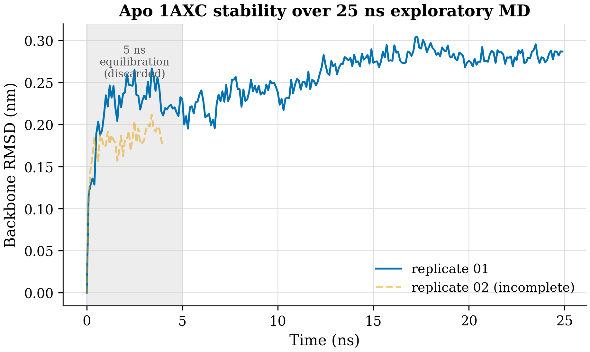
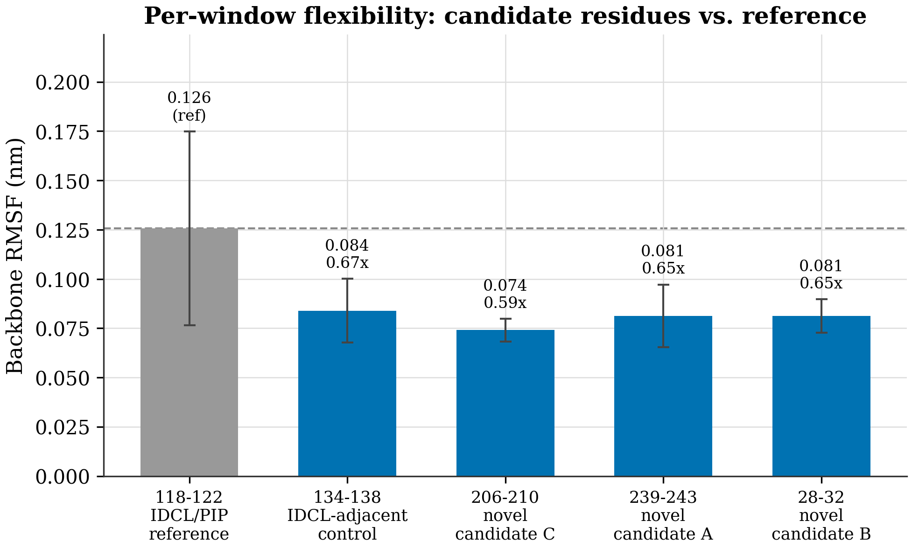

# Figure placement guide — GNN-PCNA paper

All 8 figures are publication-ready PNGs (300 DPI) in `paper/figures/`. Every number
in them is computed from the real run manifests and the real 25 ns MD analysis.
Insert them in the order below (Figure 1–8). Each entry has the file, the section it
belongs in, what it shows, and the exact caption to paste.

> Tip: open this file in a Markdown viewer that can see `figures/` (e.g. Obsidian)
> and the previews below will render. The hero figures (most impactful, most
> defensible in a judge interview) are ⭐ **Fig 2, Fig 3, Fig 8**.

---

## METHODS section

### Figure 1 — Dataset composition & frozen split
`paper/figures/dataset_split.png`

- **Shows:** structure counts across the cross-validation folds and the held-out test
  set (homology-blocked at 30% identity, PCNA held out); residue label composition
  (16,335 positive vs 3,704 masked).
- **Caption:** *Figure 1. Dataset composition and frozen split. Left: structure counts
  across the frozen cross-validation folds and the held-out test set (homology-blocked
  at 30% sequence identity; the PCNA cluster is held out entirely). Right: residue label
  composition (positive vs masked) under the positive-unlabeled policy. Split manifest
  hash 24dd5e34; the test set was never loaded during model selection.*

### ⭐ Figure 2 — Why macro-AUPRC, not AUROC
`paper/figures/metric_choice.png`

- **Shows:** macro-AUPRC vs macro-AUROC for the model and naive baselines; a random
  scorer hits AUROC ≈ 0.50 but AUPRC ≈ 0.05 at ~4.6% prevalence. This is the rigor
  figure — it justifies the whole metric choice.
- **Caption:** *Figure 2. Why macro-AUPRC, not AUROC, under class imbalance. At ~4.6%
  positive prevalence (dashed AUPRC floor), a random scorer reaches AUROC ≈ 0.50 but
  AUPRC ≈ 0.05; AUROC therefore overstates skill. macro-AUPRC against the prevalence
  baseline is reported as the primary metric. Validation only.*

---

## RESULTS section

### ⭐ Figure 3 — Model vs. baselines
`paper/figures/baseline_comparison.png`

- **Shows:** validation macro-AUPRC for the primary GraphSAGE-3L and every baseline on
  the same frozen split, ±1 SD; random/degree mark the prevalence floor. The headline
  result figure.
- **Caption:** *Figure 3. Validation macro-AUPRC across models and baselines, on the same
  frozen, homology-blocked split (hash 24dd5e34). Error bars are ±1 SD over 4 folds × 3
  seeds where applicable. Random and degree references indicate the prevalence floor. The
  test set was not evaluated; these are validation, model-selection metrics only.*

### Figure 4 — Per-fold performance
`paper/figures/per_fold_performance.png`

- **Shows:** per-fold validation macro-AUPRC for the primary model and GNN baselines;
  fold 1 is a more favorable partition across all models (difficulty, not seed luck).
- **Caption:** *Figure 4. Per-fold validation macro-AUPRC for the primary model and GNN
  baselines (mean over 3 seeds). Fold-to-fold variation is modest; fold 1 is a more
  favorable partition across all models, indicating partition difficulty rather than seed
  luck. Validation only.*

### Figure 5 — Edge-type ablation
`paper/figures/ablation_edges.png`

- **Shows:** removing spatial edges hurts; removing sequential edges does not (Δ +0.0021,
  within 1 SD). The honest "what actually matters" figure.
- **Caption:** *Figure 5. Edge-type ablation on validation macro-AUPRC. Removing spatial
  edges degrades performance; removing sequential edges does not, and marginally exceeds
  the full model (Δ +0.0021, within 1 SD) — the sequential-edge contribution is not
  established and warrants further investigation. Validation only.*

### Figure 6 — Learning curves
`paper/figures/training_curves.png`

- **Shows:** validation macro-AUPRC vs epoch for all 12 runs with the across-run mean;
  early stopping limits overfitting.
- **Caption:** *Figure 6. Validation macro-AUPRC versus epoch for all 12 primary-model
  runs (4 folds × 3 seeds; faint lines) with the across-run mean (bold). Early stopping
  (patience 10) halts each run near its validation peak, limiting overfitting.*

---

## MOLECULAR-DYNAMICS TRIAGE section

### Figure 7 — Backbone RMSD (25 ns)
`paper/figures/md_rmsd.png`

- **Shows:** backbone RMSD vs time for the apo 1AXC run; one complete 25 ns replicate
  (a second incomplete at 4 ns, dashed); 5 ns equilibration shaded; plateau ~0.25 nm =
  stable trimer.
- **Caption:** *Figure 7. Backbone RMSD versus time for the apo 1AXC simulation (one
  complete replicate to 25 ns; a second replicate incomplete at 4 ns, dashed). The first
  5 ns (shaded) are discarded as equilibration. RMSD plateaus near 0.25 nm, indicating a
  stable fold. Exploratory only.*

### ⭐ Figure 8 — Per-window Cα RMSF (the honest negative result)
`paper/figures/md_rmsf.png`

- **Shows:** the GNN candidate windows (239–243, 28–32, 206–210) and the IDCL-adjacent
  control (134–138) are all 0.59–0.67× the IDCL/PIP reference (118–122) — candidates are
  NOT more flexible. This is the figure that carries the honest negative finding; judges
  respect it.
- **Caption:** *Figure 8. Mean backbone Cα RMSF over the equilibrated 25 ns window for the
  GNN candidate-pocket windows (blue) versus the IDCL/PIP reference region (grey, dashed).
  Candidate residues sit at 0.59–0.67× the reference — they do not show enhanced mobility,
  so this short simulation provides no evidence of cryptic-pocket opening. Longer
  timescales and a positive control are required.*

---

## Assembly notes
- Order of appearance = Figure number. Sections: Methods (1–2), Results (3–6), MD Triage (7–8).
- Files are 300 DPI; safe to place at full text-column width (md_rmsf/md_rmsd are wide; the
  bar charts and dataset_split are fine full-width too).
- If you want the final `.docx` with these embedded automatically, the engine's assembler
  (`paper_engine/manuscript/assemble_docx.py`) takes the Markdown + this figure set and
  produces the Word file — just ask.
