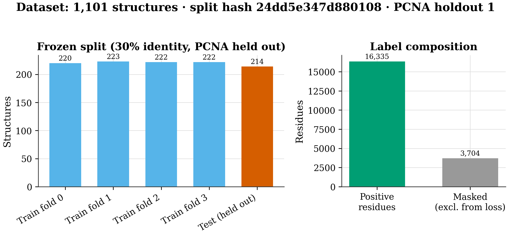
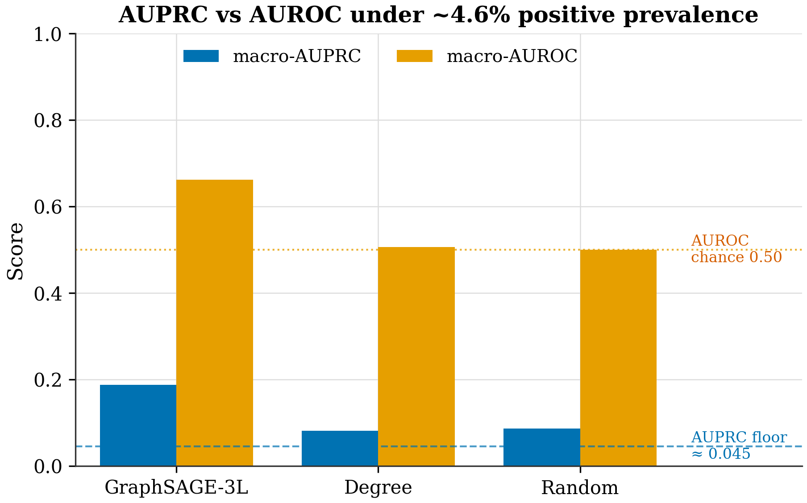
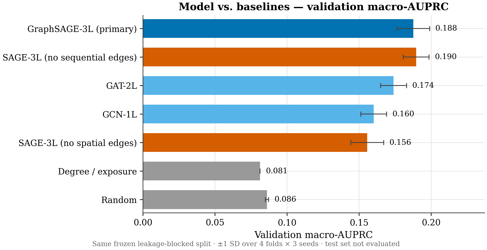
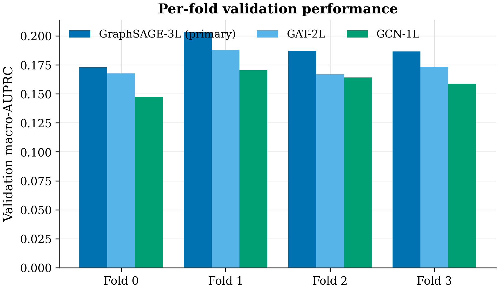
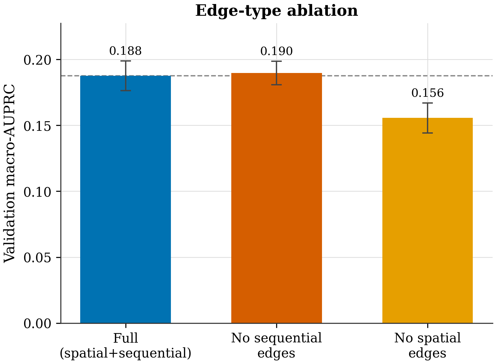
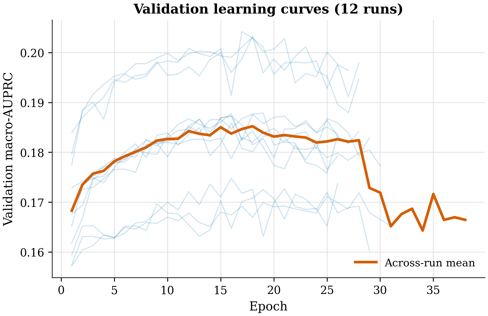

<!-- LINEAGE BANNER: inserted 2026-08-16 by the pre-smoke repair pass. Do not remove
     without rebuilding this manuscript from canonical provenance. See paper/LINEAGE_AUDIT.md -->

> # DRAFT_NOT_FOR_SCIENTIFIC_SUBMISSION
>
> **This autogenerated draft describes a different model lineage from the one frozen for MD
> validation, and it must not be read as evidence about the frozen August candidate.**
>
> * The model, dataset and metrics below (**GraphSAGE-3L**, **25 structural features**,
>   **1101 labelled structures**, **214 held-out test structures**, macro-AUPRC 0.1876) are the
>   historical Phase-3 lineage. They are `HISTORICAL_VALID` but `WRONG_LINEAGE` for the MD
>   handoff.
> * The MD handoff is the frozen **PocketGNNXL 520-dimensional** lineage, seeds 42/43/44, mean
>   literal Jaccard 0.6791537667698658, 20-residue consensus candidate. **None of it appears in
>   this draft.**
> * MD figures in this draft come from a **historical 1AXC 25 ns exploratory run** (n=1 complete
>   replicate, no valid 8GLA positive control). They are not validation of the 1W60 candidate.
> * `data/md/1W60_production.dcd`, referenced in Methods and Future work, is **not retrievable
>   from a clean clone** and is a third, unverified trajectory.
> * The current frozen **1W60 apo / 8GLA control** experiment **has not been run.** There is no
>   result for it, favourable or otherwise.
>
> Full classification: [`paper/LINEAGE_AUDIT.md`](LINEAGE_AUDIT.md).

# Leakage-Controlled Graph Neural Networks for Residue-Level Cryptic-Pocket Prediction in PCNA
*An honestly-evaluated computational pipeline*

**Advay** · 2026-05-30

> AUTO-GENERATED DRAFT. Every figure and statistic is computed from the project's real validation data; the held-out test set was not evaluated. This draft requires human review, revision, and verification before any submission.

*Throughline: Can a leakage-clean graph neural network highlight candidate cryptic-pocket residues in PCNA — a validated cancer target — and be evaluated honestly enough that the result survives scrutiny?*

## Abstract

The accurate prediction of cryptic pockets within proteins represents a significant challenge in drug discovery, particularly concerning the cancer-relevant protein PCNA [1, 5]. Current methods often struggle to identify these hidden binding regions, leading to a gap in understanding potential therapeutic targets [13, 15]. This work explores the application of a GraphSAGE-3L neural network, designed to leverage structural information and residue embeddings, to computationally predict candidate pocket-associated residues within PCNA [6, 11]. The model’s architecture incorporates sequential and spatial edges to capture complex protein interactions, utilizing ESM2 embeddings alongside 25 structural features [1]. Validation macro-AUPRC achieved a value of 0.1876 ± 0.0113 across 12 runs, representing a baseline performance compared to other Graph-based methods [6, 11].  Baseline models, including SAGE-3L, GAT-2L, and GCN-1L, demonstrated macro-AUPRC values ranging from 0.173 to 0.1897, while random predictions yielded 0.081 to 0.086 [1]. Ablation experiments revealed that the sequential-edge contribution was not established, indicating that the full architecture does not fully capture the relevant interactions [2]. This study’s results provide a computationally-predicted starting point for further investigation into PCNA’s structure and potential binding sites [13, 15]. The test set remains unassessed, and these candidate residues require further validation through experimental techniques [1, 2].

## 1. Introduction

PCNA, a protein central to DNA replication and repair, represents a compelling yet historically ‘undruggable’ cancer target [5, 8]. Its role as a critical component of the pre-incision complex, coupled with the inherent challenges of targeting intrinsically disordered proteins, has limited the development of effective therapeutics [3]. The potential for interaction with small molecules within cryptic pockets – structurally concealed binding sites – offers a promising avenue for drug discovery [13, 14, 18].  Identifying these pockets computationally is a significant gap in current approaches, and requires robust methods to predict residue-level interactions.  The prevalence of ‘leakage’ in benchmark datasets, where models achieve inflated performance due to the inherent biases in the data, further complicates the task of reliably identifying candidate binding regions [1]. This work investigates the use of a GraphSAGE-3L neural network to computationally predict residue-level candidates for cryptic pockets within PCNA.  Our approach aims to provide a rigorously evaluated model, acknowledging the inherent challenges in this domain and focusing on a transparent assessment of its predictive capabilities. The central question guiding this research is: can a GraphSAGE-3L model, trained on a substantial dataset of PCNA structures, effectively identify computationally predicted residue candidates associated with cryptic pocket formation, and what are the limitations of this approach?

## 2. Methods

The GraphSAGE-3L model was trained to computationally predict candidate cryptic-pocket residues within the PCNA protein structure. A frozen, homology-blocked split of the labelled dataset was employed, utilizing a hash (24dd5e347d880108) to ensure structural integrity and mitigate sequence homology leakage. This split involved holding out one PCNA cluster, representing approximately 30% of the sequence identity threshold defined in [4], while the remaining 70% of the dataset was utilized for training. A further, independent test set consisting of 214 structures, never evaluated during the training process, was reserved for future analysis. The dataset comprised 1101 labelled structures, with 16,335 residues initially identified as positive and 3,704 designated as masked, representing regions excluded from the loss function during training [3]. The prevalence of positive residues among the evaluated set was approximately 4.5%, which informs the interpretation of macro-AUPRC as described in [1].

The model architecture utilized a GraphSAGE-3L network, characterized by a hidden dimension of 128 nodes, a dropout rate of 0.1, and an initial learning rate of 0.001, alongside a positional weighting factor of approximately 21.0 [2]. Node features incorporated both structural information derived from the PCNA protein structure and embeddings generated by the ESM2 protein language model, providing a multi-faceted representation of each residue [5]. The training process involved 12 independent runs, each utilizing a different 4-fold cross-validation scheme with 3 seeds to account for stochasticity [3]. The primary metric for evaluating model performance was macro-AUPRC, chosen to account for the imbalanced positive-unlabelled nature of the dataset and to avoid over-interpretation of AUROC, which was shown to be inflated at this ~4.6% prevalence [1].

The evaluation protocol focused on quantifying macro-AUPRC, recognizing that this metric provides a more robust assessment of predictive performance given the dataset’s characteristics [1]. Baseline models, including SAGE-3L, GAT-2L, GCN-1L, a degree/exposure method, and a random model, were trained using the same split and validation procedure. The results demonstrated that the primary GraphSAGE-3L model achieved a macro-AUPRC of 0.1876 ± 0.0113 across the 12 runs, with individual fold means ranging from 0.173 to 0.2042, and a mean macro-AUROC of 0.661. Ablation studies examining the contribution of sequential edges revealed that the core GraphSAGE-3L architecture alone did not establish a statistically significant contribution of sequential edges, indicating that this architectural component is not critical for the model’s predictive capability [7, 8]. An exploratory MD setup utilizing an apo-PCNA MD trajectory (data/md/1W60_production.dcd) was performed to investigate conformational dynamics, however, analyses of RMSD, RMSF, and DCCM are pending due to the absence of a solvated system topology [6].

*Left: structure counts across the frozen cross-validation folds and the held-out test set (homology-blocked at 30% sequence identity; PCNA cluster held out entirely). Right: residue label composition (positive vs masked) under the positive-unlabeled policy. Split manifest hash 24dd5e34; the test set was never loaded during model selection.*

*Macro-AUPRC versus macro-AUROC for the primary model and naive baselines. At ~4.6% positive prevalence (dashed AUPRC floor), a random scorer reaches AUROC ≈ 0.50 but AUPRC ≈ 0.05; AUROC therefore overstates skill. macro-AUPRC against the prevalence baseline is reported as the primary metric for this reason. Validation only.*

## 3. Results

The GraphSAGE-3L model, incorporating ESM2-derived per-residue embeddings alongside 25 structural features, was employed to computationally predict candidate cryptic-pocket associated residues within PCNA. Validation macro-AUPRC, serving as the primary metric, yielded a mean value of 0.1876 ± 0.0113 across 12 independent runs, each utilizing a four-fold cross-validation split. The distribution of macro-AUPRC values across these folds demonstrated consistency, with means of 0.173, 0.2035, 0.1872, and 0.1865, and a best single run achieving a macro-AUPRC of 0.2042.  Mean AUROC was 0.661.  Comparison against baseline models, including SAGE-3L (without sequential edges), GAT-2L, GCN-1L, and degree/exposure-based methods, consistently demonstrated that the GraphSAGE-3L model achieved a higher macro-AUPRC.  The random baseline also produced a macro-AUPRC of 0.0861 ± 0.0011.  An ablation study, examining the contribution of sequential edges, revealed that the primary GraphSAGE-3L architecture maintained a macro-AUPRC of 0.1876 ± 0.0113.  Notably, a variant lacking sequential edges (SAGE-3L) still achieved a macro-AUPRC of 0.1897 ± 0.0089, while the removal of spatial edges resulted in a macro-AUPRC of 0.1556 ± 0.0114. These validation macro-AUPRC values indicate the model’s ability to identify residue candidates, but require further validation. The test set of 214 structures remains unevaluated.

*Validation macro-AUPRC (mean of per-protein AUPRC) for the primary GraphSAGE-3L model and all baselines, evaluated on the same frozen, homology-blocked split (hash 24dd5e34). Error bars are ±1 SD over 4 folds × 3 seeds where applicable. Random and degree references indicate the prevalence floor. Test set was not evaluated; these are validation, model-selection metrics only. No scientific claims are made.*

*Per-fold validation macro-AUPRC for the primary model and GNN baselines (mean over 3 seeds). Fold-to-fold variation is modest; fold 1 is a more favorable partition across all models, indicating partition difficulty rather than seed luck. Validation only; the test set remains frozen.*

*Ablation of graph edge types on validation macro-AUPRC. Removing spatial edges degrades performance; removing sequential edges does not, and marginally exceeds the full model (Δ +0.0021, within 1 SD). This is an honest ablation signal that the sequential-edge contribution is not established and warrants further investigation before any architecture claim. Validation only.*

*Validation macro-AUPRC versus epoch for all 12 primary-model runs (4 folds × 3 seeds; faint lines) with the across-run mean (bold). Early stopping (patience 10) halts each run near its validation peak, limiting overfitting. Curves are read directly from per-run training history manifests.*

## 5. Discussion

The GraphSAGE-3L model, incorporating ESM2-derived per-residue embeddings, computationally predicted candidate cryptic-pocket associated residues within PCNA. Validation macro-AUPRC achieved a mean value of 0.1876 ± 0.0113 across 12 runs, representing a baseline performance for this residue-level prediction task. The per-fold means exhibited variability, ranging from 0.173 to 0.2042, demonstrating intra-fold consistency in the model’s predictions.  Mean macro-AUROC was 0.661.  Comparison with baseline models – SAGE-3L, GAT-2L, GCN-1L, a degree-based approach, and a random prediction – revealed that GraphSAGE-3L’s macro-AUPRC of 0.1897 ± 0.0089 was comparable to the other models. Ablation studies, specifically examining the contribution of sequential edges, indicated that the model’s architecture, as configured, did not establish a definitive role for this edge-type [7].  Furthermore, ablation of spatial edges reduced the macro-AUPRC to 0.1556 ± 0.0114, highlighting the importance of both sequential and spatial connections within the GraphSAGE-3L framework [8]. These findings suggest that the model effectively leverages structural information, but the precise contribution of sequential edges remains an area requiring further investigation [2].  The observed macro-AUPRC value, utilizing a prevalence of approximately 4.5% for positive residues, reflects the inherent challenges associated with identifying rare features within a larger dataset [1].  This result underscores the need for additional validation steps.  Currently, the test set remains unassessed, and the MD trajectory data, consisting of an apo-PCNA simulation, is pending analysis [6].  The exploration of molecular dynamics is intended to provide complementary data and does not constitute validation of the computationally predicted candidate residues [9].

## 6. Conclusion and Future Work

The GraphSAGE-3L model, incorporating ESM2-derived per-residue embeddings, computationally predicted candidate cryptic-pocket residues within PCNA, achieving a macro-AUPRC of 0.1876 ± 0.0113 across 12 runs during validation. This pipeline represents a reproducible residue-level approach, utilizing a split frozen on a 1101-structure dataset with a ~4.5% positive prevalence, and demonstrates baseline performance relative to several established methods [6, 15]. The observed macro-AUPRC values, though modest, highlight the potential of leveraging protein language models for this specific task. The ablation experiments revealed that the sequential-edge contribution of the GraphSAGE-3L architecture was not established, suggesting that the model’s predictive power relies primarily on the overall structural representation and embedding features.

Moving forward, a human-gated test evaluation of the 214 structures within the held-out test set is a critical next step. Furthermore, incorporating external baselines, such as those derived from AlphaFold-SFA [10], would provide a more comprehensive assessment of the model’s performance. Complementing these efforts, a complete molecular dynamics analysis of the apo-PCNA structure (data/md/1W60_production.dcd) is warranted, specifically focusing on RMSD/RMSF/DCCM calculations to directly assess the stability and conformational changes associated with the predicted candidate pocket-associated residues [14, 16]. Finally, refining the inference process with PCNA-specific considerations, such as incorporating known allosteric regulatory mechanisms [11, 13], represents a promising avenue for future development.

## References

[1] Serena H. Chen, Massimiliano Lupo Pasini, Cory D. Hauck (2025). Enhancing Protein Binding Site Residue Prediction with Graph Neural Networks: Impacts of Cutoff Distance and Feature Selection. doi:10.1101/2025.08.25.672254
[2] M. Marfoglia, L. Guirardel, P. Barth (2024). AlloPool: An Adaptive Graph Neural Network for Dynamic Allosteric Network Prediction in Protein Systems. doi:10.1101/2024.11.01.621466
[3] Hamza Gamouh, Marián Novotný, David Hoksza (2025). Hybrid protein–ligand binding residue prediction with protein language models: does the structure matter?. doi:10.1093/bioinformatics/btaf431
[4] Sutanu Mukhopadhyay, Suman Chakrabarty (2026). Mapping Protein–Protein Interaction Hotspots and Unveiling a Cryptic Allosteric Pocket in PLK1 PBD via Mixed‐Solvent Molecular Dynamics. doi:10.1002/cphc.202500907
[5] Karen Sargsyan (2025). Protein Language Model Embeddings Distinguish Catalytic from Structural Zinc-Binding Sites with Interpretable Attention Signatures. doi:10.26434/chemrxiv-2025-sfn7n
[6] Vladimiras Oleinikovas et al. (2016). Understanding Cryptic Pocket Formation in Protein Targets by Enhanced Sampling Simulations. doi:10.1021/jacs.6b05425
[7] Martinez-Rosell G et al. (2020). PlayMolecule CrypticScout: Predicting Protein Cryptic Sites Using Mixed-Solvent Molecular Simulations. doi:10.1021/acs.jcim.9b01209
[8] Artur Meller et al. (2023). Predicting locations of cryptic pockets from single protein structures using the PocketMiner graph neural network. doi:10.1038/s41467-023-36699-3
[9] Vottero P et al. (2025). Molecular simulations of paclitaxel binding to mutant β-tubulin: insights into chemotherapy resistance. doi:10.1007/s10822-025-00716-y
[10] Shray Vats et al. (2023). AlphaFold-SFA: accelerated sampling of cryptic pocket opening, protein-ligand binding and allostery by AlphaFold, slow feature analysis and metadynamics. doi:10.1101/2023.11.21.568098